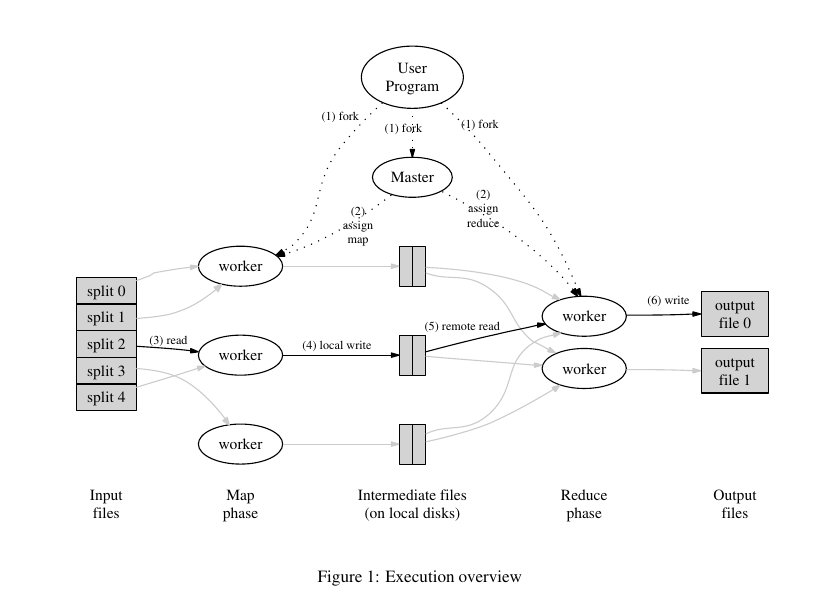

# MapReduce实现

主要结构按照论文编写：

<p align="center">
    
</p>

包含容错功能，支持多机部署

分布式文件系统采用hdfs

与论文不同的地方是中间文件也存储于分布式文件系统，减少了额外的RPC调用

其中Reduce数量由代码指定，Map数量由输入文件数量决定

## 代码文件

```
.
├── apps
│   └── wordcount.go // 用户编写部分
├── imgs
├── main
│   ├── input.txt
│   ├── mrmaster.go  // 部署一个Master节点
│   └── mrworker.go  // 部署一个Worker节点
├── mr
│   ├── master.go    // Master逻辑部分
│   ├── rpc.go       // RPC相关定义
│   └── worker.go    // Worker逻辑部分
├── go.mod
├── README.md
└── run.sh
```

主节点与从节点间通过RPC通信，提供三个RPC接口：`RegisterWorker`，`ApplyTask`，`FinishTask`

## 运行

单机伪分布式运行：

`sh run.sh`
